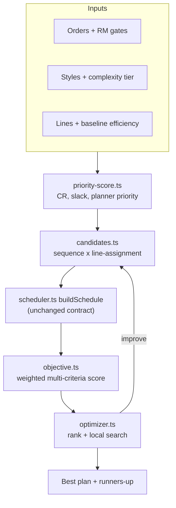

# Multi-Criteria Optimization Engine (MCOE)

## The core reframe

[buildSchedule](src/lib/engine/scheduler.ts) is today a *dispatcher*: sort by deadline, greedily fill capacity, stop. Nothing is ever compared against an alternative. But it is also pure, deterministic and fast, which makes it a perfect **evaluator**. The optimizer is a search loop around it, not a rewrite of it.



Two decisions confirmed: line assignment becomes a real decision variable, and this stays engine + seed data only (no Supabase migrations, no new UI).

## Key finding that shrinks the work

`LineSplitOverride` in [scheduler.ts](src/lib/engine/scheduler.ts) already performs line assignment. Passing `lineIds: ["line-sew-1"], ratios: [1]` confines an order to one line, and `lineBusyUntil` is only written for lines in `lastDateUsedByLine` — so a line the order never touched stays free for the next order. **Parallel orders across lines already work today**; nothing generates the assignments. Phase 2 is a generator plus a rename, not surgery on the core loop.

---

## Phase 1 — Fix the physics

The optimizer is only as good as what it scores. Four fidelity gaps, all local.

**1a. Changeover cost model** — new `src/lib/engine/changeover.ts`

Track the last style per line across the whole run (new `lineLastStyle: Map<lineId, styleId>` in `buildSchedule`). Derive cost from style attributes rather than unavailable history:

```ts
export function changeoverMinutes(from: Style | undefined, to: Style): number {
  if (!from) return 0;                    // first run on the line
  if (from.id === to.id) return 0;        // same style continues
  const base = CHANGEOVER_BASE_MINUTES;   // 45
  const complexityGap = Math.abs(from.complexity - to.complexity) * COMPLEXITY_SPREAD;
  const fabricPenalty = from.fabricType !== to.fabricType ? FABRIC_CHANGE_MINUTES : 0;
  return base + complexityGap + fabricPenalty;
}
```

Subtract from `shiftMinutes` on the first day of the new style, inside `scheduleMultiLineStage`. Add an optional `fabricType` to `Style` in [types.ts](src/lib/types.ts) with seed values.

**1b. Learning retention across repeat orders**

[scheduler.ts:156](src/lib/engine/scheduler.ts) sets `dayOnStyle: 0` every time a line picks up an order, so the second PO of a style restarts at 55%. Replace with a retention lookup keyed on `${lineId}:${styleId}`, decayed by idle time:

```ts
const retained = priorDays * Math.exp(-elapsedDays / RETENTION_HALFLIFE_DAYS);
dayOnStyle = Math.floor(retained);
```

**1c. Complexity tiers drive the curve, not SMV** — new `src/lib/engine/complexity.ts`

`complexityFactor` in [capacity.ts:43](src/lib/engine/capacity.ts) is `1 + (complexity - 1) * 0.08`, so the hoodie at complexity 1.8 gets a 6.4% SMV bump — negligible, and double-counting, since seed SMV already encodes difficulty (tee sewing 8.4 vs hoodie 18.2). Delete it from the SMV path and let complexity drive the ramp instead:

```ts
efficiency(day) = target - (target - start) * Math.exp(-(day - 1) / tau)
```

with `start` and `tau` from a named tier (T1 Basic through T4 Complex). Explicit per-style curves in `learningCurves` still win when present, so seed data stays valid. This is a deliberate behavior change of up to ~6% on capacity.

**1d. RM buffer and multi-material gate**

Add optional `materials: { name: string; inHouseDate: string }[]` to `Order` and a `RM_BUFFER_DAYS` constant. Effective gate becomes `max(inHouseDates) + buffer`, falling back to today's single `rmInHouseDate` when `materials` is absent.

## Phase 2 — Line assignment as a decision variable

Generalize `LineSplitOverride` to `LineAssignment` (keep the old name as a type alias so [ripple.ts](src/lib/engine/ripple.ts) and [repository.ts](src/lib/data/repository.ts) keep compiling), and add `src/lib/engine/assignment.ts` with three strategies:

- `spreadAll` — today's behavior, kept as the baseline to beat
- `dedicate` — one line per order, chosen by `efficiencyBaseline` and lowest changeover from that line's current style
- `balanced` — least-loaded line by projected finish

## Phase 3 — Scoring

**Objective function** — new `src/lib/engine/objective.ts`. Lower is better:

```ts
score = W.tardiness  * weightedTardinessDays
      + W.changeover * changeoverHours
      + W.idle       * idleCapacityHours
      + W.churn      * ordersMovedVsPublishedPlan
      - W.throughput * unitsCompletedInHorizon
```

`W` lives in one exported `SCORING_WEIGHTS` object — this is the configurable rules engine deferred for customer review, so it needs to be trivially swappable.

**Priority score** — new `src/lib/engine/priority-score.ts`. Critical Ratio computed safely, given the failure modes discussed:

```ts
const remainingLeadDays = estimateRemainingLeadTime(order, style, lines); // SMV + qty + curve
const cr = (dueDays) / Math.max(remainingLeadDays, MIN_LEAD_DAYS);        // no divide-by-zero blowup
if (cr < CR_UNRECOVERABLE) return { bucket: "replan_delivery", score: 0 }; // hopeless jobs leave the race
```

CR is one weighted input to the priority score alongside planner priority and RM readiness — never the sort key on its own.

## Phase 4 — The optimizer loop

New `src/lib/engine/optimizer.ts`:

1. Generate candidates as the cross product of 4 sequence strategies (deadline, critical-ratio, changeover-minimizing, slack-per-operation) and 3 assignment strategies — 12 base plans.
2. Evaluate each through `buildSchedule`, score through `objective.ts`.
3. Local search from the best: pairwise adjacent-order swaps and single-order line reassignments, keep improvements, cap iterations.
4. Return the winner plus runners-up with per-criterion breakdowns, so a planner sees the trade rather than a black-box answer.

`runAutoSequence` in [run-sequence.ts](src/lib/engine/run-sequence.ts) switches to calling the optimizer, with the deadline + spreadAll candidate as a guaranteed fallback.

## Phase 5 — Run-size viability and what-if

**Run-size** — new `src/lib/engine/run-size.ts`. From the curve and line capacity, compute units produced before crossing 85% efficiency. If `order.quantity` falls below that, flag a sub-scale run and search for merge candidates (same `styleId`, deadlines within a window).

**Scenarios** — new `src/lib/engine/scenario.ts`. `runScenario(base, mutations)` returning a scored plan plus a diff against the baseline. Mutations: shift an RM date, add overtime minutes, change operator count, add or drop an order.

**Grounded AI (optional, touches the API layer)** — in [copilot.ts](src/lib/ai/copilot.ts), each recovery option becomes a scenario that is actually simulated, so `impactDays` is computed rather than invented by the model. The LLM's job shrinks to narrating real numbers.

## Verification

No test framework exists today. Add `tsx` as a dev dependency and a `scripts/benchmark-mcoe.ts` that runs the demo dataset through baseline and optimized paths and prints the per-criterion table: total tardiness days, changeover hours, idle hours, units completed, and wall-clock time. This is both the regression check and the artifact to show the customer.

Guardrails: `npm run typecheck` and `npm run lint` clean at every phase; the deadline + spreadAll candidate must reproduce today's schedule exactly after Phase 2, before any Phase 1 physics changes are enabled, to prove the wrapper is behavior-preserving.

## Out of scope

Supabase migrations, UI for the new data, operator skill matrix, and curve fitting from production history — all deferred until the model is signed off and there is real data to fit against.