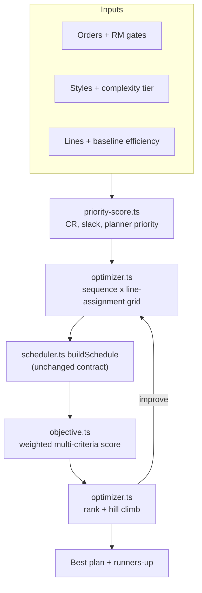

# Multi-Criteria Optimization Engine (MCOE)

As-built reference for the optimization layer in ThreadPlan OS. Covers the design
rationale, what shipped, the measured results, and the decisions a future reader
would otherwise have to reverse-engineer.

Companion docs: [README.md](README.md) for the app, [HANDOVER.md](HANDOVER.md)
for overall state and known gaps.

---

## 1. The core reframe

`buildSchedule` in [src/lib/engine/scheduler.ts](src/lib/engine/scheduler.ts) was
a *dispatcher*: sort orders by deadline, greedily fill capacity, stop. Nothing was
ever compared against an alternative, so there was no sense in which the output
was "optimal" — only "consistent".

It is, however, pure, deterministic and fast. That makes it a usable **evaluator**.
The optimizer is therefore a search loop wrapped around it, not a rewrite of it.
The core scheduling loop was left structurally intact.



Two scoping decisions, agreed before implementation:

- Line assignment is a real decision variable, not a fixed spread.
- Engine and seed data only. No Supabase migrations, no new UI.

## 2. The finding that shrank the work

`LineSplitOverride` already performed line assignment. Passing
`lineIds: ["line-sew-1"], ratios: [1]` confines an order to one line, and
`lineBusyUntil` is only written for lines that actually produced — so a line an
order never touched stays free for the next order.

**Parallel orders across lines already worked.** Nothing generated the
assignments. Phase 2 became a generator plus a rename rather than surgery on the
scheduling loop.

---

## 3. Physics layer

The optimizer is only as good as the model it scores against. Four fidelity gaps
were closed first. All four are individually switchable via
[physics.ts](src/lib/engine/physics.ts), which is what makes the parity gate in
section 6 possible.

### 3a. Changeover — [changeover.ts](src/lib/engine/changeover.ts)

Sequence-dependent setup cost, tracked through a `lineLastStyle` map maintained
across the whole `buildSchedule` run and deducted from `shiftMinutes` on the
first productive day of a new style.

```
minutes = (BASE + |Δcomplexity| × SPREAD + fabricChanged × FABRIC) × stageWeight
```

Measured changeover history per line is the ideal input, but no factory has it
cleanly on day one. Deriving it from style attributes we already hold gives a
defensible estimate now; swap the implementation when real data exists, since
nothing else depends on how the number is produced.

Stage weights reflect that sewing is the expensive retool and packing is nearly
free: knitting 0.6, cutting 0.5, sewing 1.0, packing 0.3.

### 3b. Learning retention — [capacity.ts](src/lib/engine/capacity.ts)

Previously `dayOnStyle` reset to zero every time a line picked up an order, so
the second PO of a style restarted at 55% efficiency as though nobody had ever
sewn it. For a factory whose volume is mostly repeat business this made the
engine systematically pessimistic.

Learning is now retained per `lineId:styleId` and decays with idle time:

```
retainedDays = priorDays × exp(-idleDays / RETENTION_DECAY_DAYS)
```

### 3c. Complexity drives the ramp, not SMV — [complexity.ts](src/lib/engine/complexity.ts)

The old `complexityFactor` was `1 + (complexity - 1) × 0.08`, giving the hoodie
at complexity 1.8 a 6.4% SMV bump. That was both negligible and double-counting,
since per-style SMV already encodes garment difficulty (tee sewing 8.4 vs hoodie
18.2 minutes).

Complexity's real effect is on how long a line takes to *reach* steady state, not
on the steady state itself. So it now drives an exponential learning curve:

```
efficiency(day) = start + (target - start) × (1 - exp(-(day - 1) / tau))
```

with `start` and `tau` from a named tier (T1 Basic through T4 Advanced), tuned to
track the previously hand-authored seed curves. A parametric curve is preferred
over seven typed-in points because two parameters can be fitted from production
history, whereas hand-entered points can only be guessed at and go stale.

Explicitly authored curves still win when present — measured data beats a model.
`complexityFactor` is retained but used only under `LEGACY_PHYSICS`.

### 3d. RM buffer and multi-material gate — [material-gate.ts](src/lib/engine/material-gate.ts)

Fabric, trims and labels arrive separately, so the real gate is the *latest* of
them plus a buffer for inspection and issue to the floor. `Order.materials` is
optional; orders carrying only the legacy single `rmInHouseDate` fall back to it.

---

## 4. Optimization layer

### Line assignment — [assignment.ts](src/lib/engine/assignment.ts)

Three strategies, chosen by scoring each candidate line on
`currentLoad + workMinutes + setup × weight`:

- `spreadAll` — every order occupies every line in the stage. The historical
  behaviour and the baseline to beat.
- `dedicate` — pins an order to one line, weighting changeover avoidance heavily
  (×8) so runs of the same style cluster together.
- `balanced` — same mechanism, weighting load over setup (×1), so it chases the
  earliest free line.

### Objective — [objective.ts](src/lib/engine/objective.ts)

Lower is better:

```
score = W.tardiness  × weightedTardinessDays
      + W.unfinished × ordersNotCompletingInHorizon
      + W.changeover × changeoverHours
      + W.idle       × idleCapacityHours
      + W.churn      × ordersMovedVsPublishedPlan
      - W.throughput × unitsCompletedInHorizon
```

Tardiness is weighted by planner priority. Churn counts orders whose position
moved against the published plan, because a factory that cannot trust the
sequence stops following it.

`SCORING_WEIGHTS` is a single exported object. **These weights are the
configurable rules engine that was deferred for customer review.** "How many
hours of changeover is a day of lateness worth" is a business decision, and it
is the one input the whole engine hinges on.

### Critical Ratio — [priority-score.ts](src/lib/engine/priority-score.ts)

CR is a single-machine dispatching rule and misbehaves if used naively. Three
failure modes are handled explicitly:

- **Negative CR inverts triage.** Once an order is past due the numerator goes
  negative, so sorting by CR puts the *most hopeless* job first and starves jobs
  that are still recoverable. Orders below `CR_UNRECOVERABLE` move to a
  `replan_delivery` bucket and leave the sequencing race.
- **CR explodes near completion.** The denominator is floored at `MIN_LEAD_DAYS`.
- **CR is per-order, but this is a four-stage flow shop.** It is one weighted
  input alongside planner priority and RM readiness, never the sort key alone.
  `sequenceBySlackPerOperation` provides the flow-shop-friendlier alternative.

**Known limitation:** `estimateRemainingLeadTime` assumes an order has the
stage's whole line pool to itself and ignores queueing, so CR reads
optimistically. On the demo data every order shows positive slack while five
finish late. This is inherent to CR as a per-order measure. CR feeds candidate
generation; the simulated completion dates are the delivery truth.

### Search — [optimizer.ts](src/lib/engine/optimizer.ts)

1. Build the cross product of 4 sequence strategies (deadline, criticalRatio,
   slackPerOperation, changeoverMinimizing) and 3 assignment strategies — 12
   base plans.
2. Simulate each through `buildSchedule`, score each through `objective.ts`.
3. Hill-climb from the winner using adjacent swaps, recomputing assignments for
   each trial sequence. Small neighbourhood on purpose: every evaluation is a
   full simulation, and planners value a plan that stays explainable.
4. Return the winner plus runners-up with per-criterion breakdowns, so the trade
   is visible rather than a black-box answer.

`runAutoSequence` calls the optimizer and falls back to the plain
deadline-ordered schedule if the search throws. A failed search must never block
planning.

---

## 5. Planning aids

**Run-size viability** — [run-size.ts](src/lib/engine/run-size.ts). Walks the
learning curve accumulating output until the line crosses 85% efficiency. If the
order finishes before that, the ramp never amortises and the run is flagged
sub-scale, with same-style merge candidates within a 21-day window.

**What-if scenarios** — [scenario.ts](src/lib/engine/scenario.ts). A scenario is
another candidate plan built from perturbed inputs. Two modes, answering
different questions:

- Default (hold the sequence): "what happens to the plan I already published?"
- `reoptimize`: "what is the best I could do about it?"

Mutations cover RM date shifts, deadline shifts, overtime, operator count,
packing type, quantity, and adding or dropping orders.

**Grounded AI recovery** — [recovery.ts](src/lib/engine/recovery.ts). Every
recovery option is simulated through the scheduler, so `impactDays` is measured
rather than estimated. Options that do not help are dropped rather than shipped
with an invented benefit. [copilot.ts](src/lib/ai/copilot.ts) passes them to the
model as authoritative, and `reconcileWithGrounded` lets the model reword titles
and descriptions while preventing it from touching any measured number.

---

## 6. Verification

There is no test framework in the repo. Verification is two scripts.

**Parity gate** — `npm run verify:parity`. Replays a date-anchored fixture
through `LEGACY_PHYSICS` plus `spreadAll` and asserts the result is identical to
a golden baseline captured from the pre-MCOE code. Currently **73 cells
identical**. This is what proves every behaviour change is attributable to a
named physics flag rather than an accident in the wrapper.

`npm run capture:golden` re-baselines, and should only ever be run from a
known-good commit.

The fixture in [scripts/fixture.ts](scripts/fixture.ts) mirrors the demo seed but
anchors every date to a fixed `ANCHOR_DATE`, because the demo data is relative to
"today" and would otherwise be impossible to compare across runs.

**Benchmark** — `npm run benchmark`. Prints the per-criterion comparison plus CR
buckets, run-size flags, what-if scenarios and simulated recovery options.

### Measured result

Like-for-like (identical physics, so the comparison is fair) the optimizer moves
the demo dataset from a score of 436.43 to 135.33:

- orders late: 5 to 1
- total tardiness: 27 days to 6
- makespan: 32 days to 26
- idle capacity: 680 to 448 line-hours
- changeover: 19.95 to 18.95 hours
- 20 plans evaluated in roughly 16 ms

The benchmark prints a third "pre-MCOE" column for context, but note it reports
zero changeover because changeover was *not modelled* then, not because none
occurred. The honest gain is the new-physics column versus the optimized column.

---

## 7. Findings worth remembering

**Not every material delay matters.** Slipping the hoodie's fabric by three days
changes nothing: that order was queued behind capacity, with a gate of Jan 10 but
no available line until Jan 20. Slipping the jogger's fabric, which is genuinely
material-gated, pushes all five orders by three days. Distinguishing
capacity-bound from material-bound orders is one of the more useful things the
scenario engine does.

**Spreading beat dedicating on this dataset.** Dedicating cuts changeover from 20
to 12 hours but loses more on tardiness than it gains — with only two sewing
lines the parallelism is not worth the slower per-order throughput. The optimizer
surfaces this as a rejected runner-up rather than hiding it. Worth revisiting at
a realistic line count. `dedicate` and `balanced` also collapse to identical
plans here, since two lines give the strategies little room to diverge.

**Most recovery options do not work.** For the most-delayed order only overtime
survived simulation, pulling the date in by exactly one day. The other three
measurably failed. That is a more useful answer than four plausible-sounding
suggestions, and it is the concrete argument for grounding the AI in simulation.

---

## 8. Module map

New, all under `src/lib/engine/`:

| Module | Role |
|---|---|
| `physics.ts` | Feature flags; `LEGACY_PHYSICS` vs `DEFAULT_PHYSICS` |
| `changeover.ts` | Sequence-dependent setup cost |
| `complexity.ts` | Complexity tiers and parametric learning curves |
| `material-gate.ts` | Multi-material RM gate plus buffer |
| `assignment.ts` | spreadAll / dedicate / balanced line assignment |
| `objective.ts` | `SCORING_WEIGHTS` and the multi-criteria score |
| `priority-score.ts` | Critical Ratio, slack-per-operation, priority buckets |
| `optimizer.ts` | Candidate grid, evaluation, hill climbing |
| `run-size.ts` | Sub-scale run detection and merge candidates |
| `scenario.ts` | What-if mutations and baseline diffing |
| `recovery.ts` | Simulated recovery options for the co-pilot |

Modified: `scheduler.ts`, `capacity.ts`, `run-sequence.ts`, `types.ts`,
`seed/demo-data.ts`, `ai/copilot.ts`, `app/api/ai/recommend/route.ts`.

Scripts: `fixture.ts`, `capture-golden.ts`, `verify-parity.ts`,
`benchmark-mcoe.ts`, and the committed `golden-baseline.json`.

---

## 9. Deliberately not done

- **Supabase migrations.** `fabricType` and `materials` are optional on the types
  and live only in seed data. Persisting them needs a migration plus repository
  wiring.
- **UI.** The objective breakdown, run-size flags and scenario diffs are computed
  but only visible from the terminal. Surfacing the score breakdown in the
  Auto-Sequence view is the highest-value next step, since the optimizer's
  reasoning is currently invisible to a planner.
- **Operator skill matrix.** Line-level `efficiencyBaseline` remains the stand-in.
  Designed as an optional refinement so the engine does not block on a data
  collection project.
- **Curve fitting from history.** The parametric curves are tuned by hand to match
  the old seed curves. Fitting `start` and `tau` from actual production is the
  point of having made them parametric.
- **Caching or rate limiting on the AI route.** Each co-pilot open now also runs a
  simulation before calling the model. The simulation is cheap; the model call is
  not.
